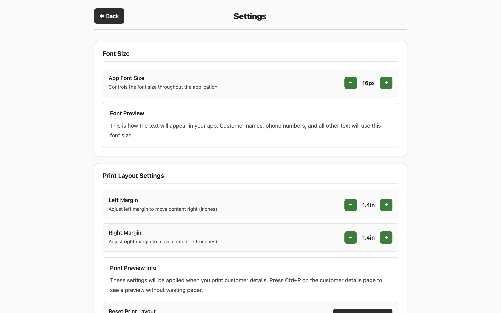
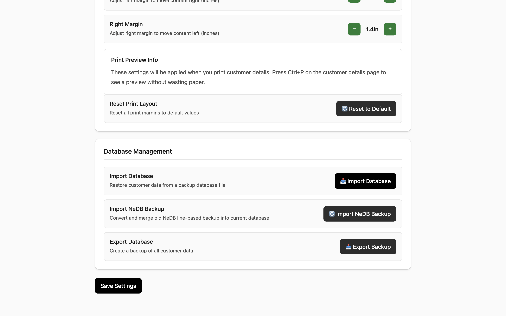
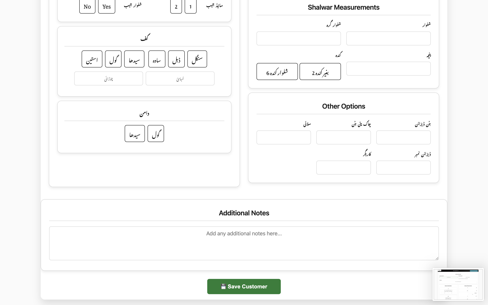
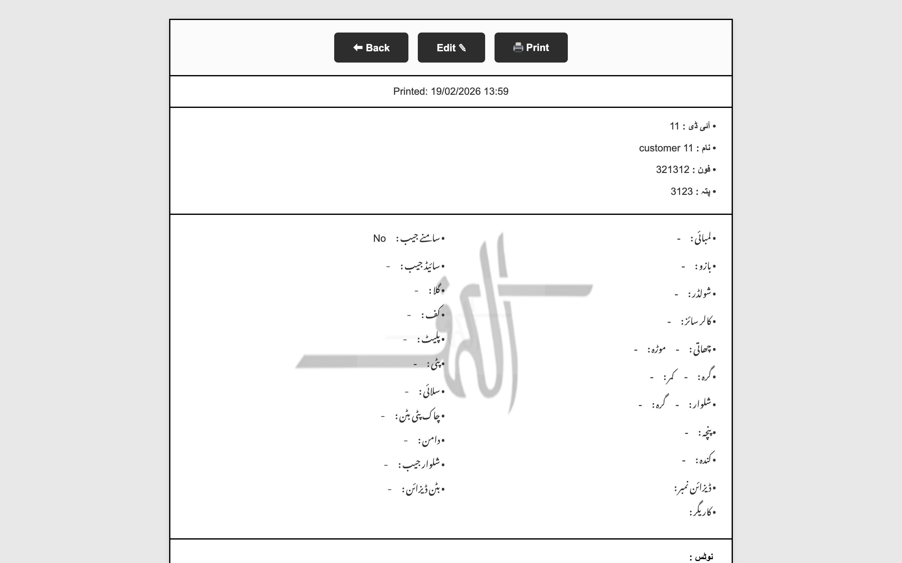
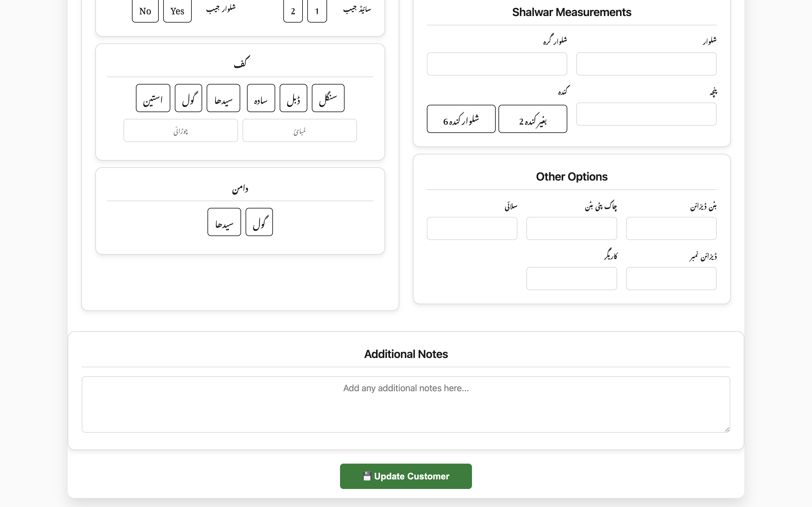

<div align="center">


# alkahf — Tailoring Management Suite

**Professional offline-first desktop application for tailoring shops**

[](CHANGELOG.md)
[](#-getting-started)
[](https://www.electronjs.org/)
[](https://www.sqlite.org/)
[](https://nodejs.org/)
[](LICENSE)
[](mailto:mr_imran_ahmad@yahoo.com)

[Features](#-features) · [Screenshots](#-screenshots) · [Tech Stack](#-tech-stack) · [Getting Started](#-getting-started) · [Architecture](#-architecture) · [Roadmap](#-roadmap) · [Support](#-support)

</div>

---

## 📌 Overview

**alkahf** is a fully offline, cross-platform desktop application built for tailoring shops to manage customer measurements, track orders, and run daily operations — no internet connection required. All data is stored in an embedded SQLite database with automatic startup backups and CSV export built in.

> Designed for Pakistani tailoring shops with full **Urdu language support** and **thermal printer** (6×8 in) compatibility.

---

## ✨ Features

<table>
<tr>
<td>

### 👤 Customer Management
- Add, edit, and view complete customer profiles
- 42-field data model: personal info + full measurements
- Fast search and filter across all records
- Unique auto-incremented ID per customer

</td>
<td>

### 📏 Measurement Tracking
- Full Qameez & Shalwar measurements
- Style options: collar, cuff, pocket, buttons
- Measurement range validation (0–200 inches)
- Urdu measurement labels supported

</td>
</tr>
<tr>
<td>

### 📦 Order Tracking
- Status: Pending / In Progress / Ready / Delivered
- Priority levels for urgent orders
- Delivery date & payment tracking
- Order notes and special instructions

</td>
<td>

### 💾 Data Safety
- Auto-backup on every app startup
- Rolling 7-backup rotation (no manual effort)
- One-click CSV export (Excel-compatible)
- SQLite — no server, no config, no failure

</td>
</tr>
<tr>
<td>

### 🖨️ Print Support
- Thermal printer-ready layout (6×8 inch)
- Print timestamp on every sheet
- Keyboard shortcut: `Ctrl+P`
- Adjustable font size via Settings

</td>
<td>

### 🔒 Security First
- Context isolation enabled
- Node integration disabled in renderer
- Secure IPC bridge via `contextBridge`
- Parameterized SQL (no injection risk)

</td>
</tr>
</table>

---

## 📸 Screenshots

<div align="center">

| | | |
|:---:|:---:|:---:|
|  |  |  |
|  |  |  |
|  |  |  |

</div>

---

## 🛠 Tech Stack

| Technology | Purpose | Version |
|------------|---------|---------|
| [Electron](https://electronjs.org) | Cross-platform desktop shell | 38.x |
| [SQLite3](https://www.sqlite.org) | Embedded local database | 3.x |
| [Node.js](https://nodejs.org) | JavaScript runtime | 16+ |
| HTML / CSS / JS | Frontend UI (Vanilla) | — |
| [electron-builder](https://electron.build) | App packaging & distribution | Latest |

---

## 🚀 Getting Started

### Prerequisites

- **Node.js** 16.x or higher — [Download](https://nodejs.org/)
- **npm** (bundled with Node.js)
- **Git** — [Download](https://git-scm.com/)

### Installation

```bash
# 1. Clone the repository
git clone https://github.com/your-username/alkahf.git
cd alkahf

# 2. Install dependencies
npm install

# 3. Start the application
npm start
```

### Build for Distribution

```bash
npm run build:win    # Windows — .exe installer + portable
npm run build:mac    # macOS  — .dmg + .zip
npm run build:linux  # Linux  — .AppImage + .deb
```

> Packaged builds output to the `dist/` folder.

### Keyboard Shortcuts

| Shortcut | Action |
|----------|--------|
| `Ctrl+S` | Save / Update customer |
| `Ctrl+N` | New customer |
| `Ctrl+E` | Export data / Edit customer |
| `Ctrl+P` | Print measurement sheet |

---

## 🏗 Architecture

```
alkahf/
├── main.js                  # Main process — window & IPC management
├── preload.js               # Secure IPC bridge (contextBridge)
├── database.js              # All database operations (SQLite)
├── main.html                # App shell / entry point
│
├── screens/                 # HTML pages (renderer)
│   ├── dashboard.html
│   ├── add-customer.html
│   ├── edit-customer.html
│   ├── customer-details.html
│   └── settings.html
│
├── renderer/                # Renderer-side JS modules
│   ├── renderer.js          # Core renderer logic
│   ├── customer-loader.js   # Customer list management
│   ├── customer-search.js   # Search & filter logic
│   ├── save-customer.js     # Form save/update handling
│   ├── customer-details.js  # Details view logic
│   ├── dashboard.js         # Dashboard stats
│   ├── navigation.js        # Screen navigation
│   └── backup.js            # Backup UI controls
│
├── css/                     # Stylesheets
│   ├── variables.css        # Design tokens (colors, fonts)
│   ├── main.css             # Global styles
│   ├── add-customer.css     # Form styles
│   └── components.css       # Shared component styles
│
├── assets/                  # App icons & static assets
└── database/
    ├── data.db              # Main SQLite database
    ├── backups/auto/        # Auto-rotating backups (×7)
    └── exports/             # CSV export output
```

### Process Model

```
┌──────────────────────────────────────────────────────────┐
│                     Main Process                         │
│  main.js — BrowserWindow, IPC handlers, database calls  │
└────────────────────┬─────────────────────────────────────┘
                     │  contextBridge (preload.js)
                     │  Secure IPC (ipcRenderer ↔ ipcMain)
┌────────────────────▼─────────────────────────────────────┐
│                  Renderer Process                        │
│  HTML screens + renderer/*.js modules                   │
│  No direct Node.js access — all via window.api          │
└──────────────────────────────────────────────────────────┘
```

---

## 🗄 Database Schema

The `customers` table stores **42 fields** per customer record:

| Category | Fields |
|----------|--------|
| Identity | `id`, `uniqueID`, `name`, `phone`, `address` |
| Qameez | `q_length`, `q_sleeve`, `q_shoulder`, `q_chest`, `q_waist`, and more |
| Shalwar | `s_length`, `s_waist`, `s_bottom`, and more |
| Style | `collar`, `cuff`, `pocket`, `button`, `design_notes` |
| Order | `status`, `order_date`, `delivery_date`, `advance`, `total`, `priority` |
| Meta | `created_at`, `updated_at`, `notes` |

---

## 🔧 Configuration

### Settings Panel (in-app)
- **Font Size** — Scale the app text for different screen sizes
- **Print Settings** — Configure thermal printer output size

### Database Paths

| Resource | Location |
|----------|----------|
| Database | `database/data.db` |
| Auto Backups | `database/backups/auto/` |
| CSV Exports | `database/exports/` |

---

## 🗺 Roadmap

- [ ] Multi-language toggle (English ↔ Urdu)
- [ ] Advanced reporting & analytics dashboard
- [ ] Bulk import / export (Excel)
- [ ] Custom measurement templates
- [ ] Receipt / invoice printing
- [ ] SMS notification integration
- [ ] Optional cloud backup
- [ ] Mobile companion app

---

## 🤝 Contributing

Contributions are welcome! Please read [CONTRIBUTING.md](CONTRIBUTING.md) before opening a pull request.

1. Fork this repository
2. Create a feature branch: `git checkout -b feature/your-feature`
3. Commit your changes: `git commit -m "feat: add your feature"`
4. Push the branch: `git push origin feature/your-feature`
5. Open a Pull Request

---

## 🐛 Troubleshooting

<details>
<summary><strong>The app won't start / spawn ENOEXEC error</strong></summary>

This usually means `node_modules` was copied from a different OS. Fix:

```bash
rm -rf node_modules
npm install
npm start
```
</details>

<details>
<summary><strong>Database issues / corruption</strong></summary>

Automatic backups run on every startup. Restore from:

```
database/backups/auto/
```

Copy the most recent `.db` file over `database/data.db`.
</details>

<details>
<summary><strong>Print layout looks wrong</strong></summary>

- Verify your printer supports **6×8 inch** paper
- Go to Settings → Print Settings and adjust
- Use print preview before sending to printer
</details>

<details>
<summary><strong>Performance is slow with many records</strong></summary>

The database is indexed on `uniqueID`. If you experience slowness, verify index integrity:

```bash
node check-db.js
```
</details>

---

## 📄 License

This software is **proprietary**. All rights reserved by Imran Ahmad.  
Unauthorized copying, distribution, or modification is strictly prohibited. See [LICENSE](LICENSE) for details.

---

## 💬 Support

| Channel | Details |
|---------|---------|
| Email | [mr_imran_ahmad@yahoo.com](mailto:mr_imran_ahmad@yahoo.com) |
| Issues | [GitHub Issues](../../issues) |

---

<div align="center">

**Built with precision by Imran Ahmad**

*Empowering businesses through innovative technology solutions.*

</div>
